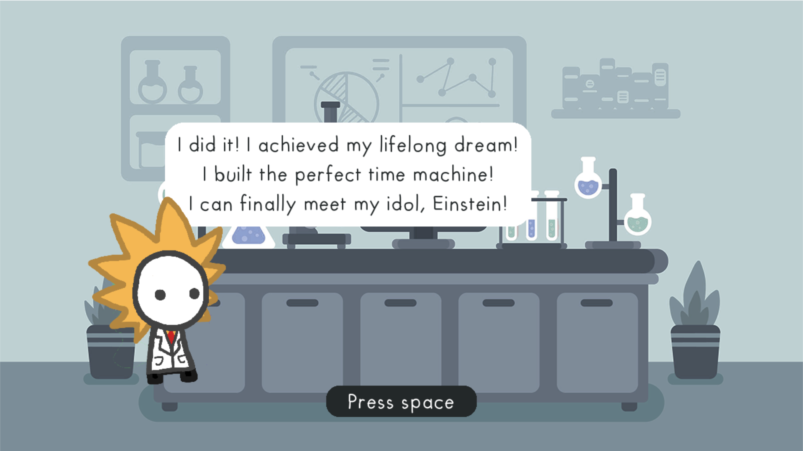

# RonTontoTon

This game was developed at the [Global Game Jam 2024](https://globalgamejam.org/games/2024/rontontoton-1).

Although building a functioning time machine is the biggest achievement of your life, meeting your idols didn't turn out as you might have hoped.



## Setup

**Requirements:**

- Python 3.9

**Note:** you might want to initialize a Python [virtual environment](https://docs.python.org/3/tutorial/venv.html).

**Install the required packages:**

```
pip install pygame
```

**Run the project:**

```
python main.py
```

**Press space to play.**

## Credit

**ART:**

- [Nicky Case](https://ncase.me) 
- [Digital Moons](https://digitalmoons.itch.io/parallax-forest-background)
- [Freepik](https://www.freepik.com/free-vector/flat-laboratory-room-illustration_12983121.htm)

**SOUNDS:**

- game music
- gasp
- [gun_cock](https://www.freesound.org/people/martian/sounds/182229/)
- [gunshot](https://www.freesound.org/people/mitchelk/sounds/136766/)
- [intro music](https://freemusicarchive.org/music/Komiku/Its_time_for_adventure_/Komiku_-_Its_time_for_adventure_-_13_Bleu/)
- jump
- [scream](https://www.freesound.org/people/GreatNate98/sounds/353086/)  
- [shout](https://www.freesound.org/people/mariallinas/sounds/222649/)
